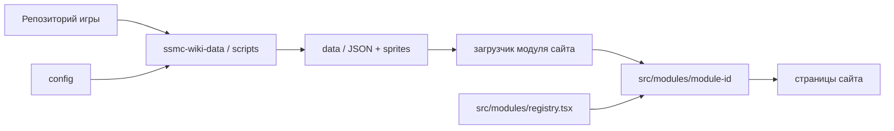
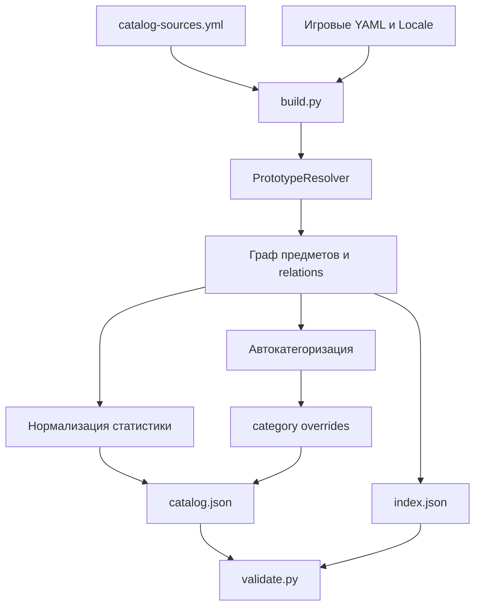
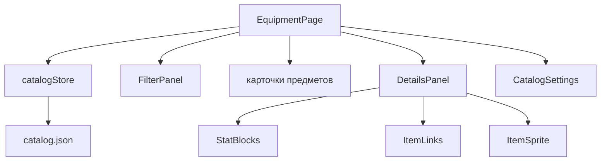

# Руководство контрибьютора SSMC Wiki

Это руководство описывает совместную архитектуру двух репозиториев:

- `DeferW/ssmc-wiki-data` — воспроизводимые сборщики данных из прототипов игры;
- `DeferW/ssmc-wiki-app` — модульное React-приложение, которое читает опубликованные JSON-контракты.

Документ предназначен для разработчиков новых сборщиков, характеристик и веб-модулей. Основной принцип проекта: **сборщик объясняет данные игры, приложение решает, как их показать**.

## 1. Общая схема



Поток изменений обычно однонаправленный:

1. Сборщик читает исходные прототипы игры.
2. Он разрешает наследование и связи между сущностями.
3. Он создаёт стабильный публичный JSON.
4. Веб-модуль загружает только свой JSON-контракт.
5. Компоненты модуля преобразуют нормализованные данные в интерфейс.

Веб-приложение не должно парсить YAML игры, угадывать наследование прототипов или читать технический `index.json`. Такая логика принадлежит `ssmc-wiki-data`.

## 2. Границы модулей

Каждый функциональный модуль живёт в отдельной папке с собственными типами, загрузчиком, форматтерами, компонентами и тестами.

Правильная структура веб-модуля:

```text
src/modules/
  registry.tsx
  equipment/
    EquipmentPage.tsx
    catalogStore.ts
    config.ts
    format.ts
    format.test.ts
    types.ts
    components/
  chemistry/
    ChemistryPage.tsx
    ...
  mobs/
    MobsPage.tsx
    ...
```

Правило: **новый модуль создаётся как `src/modules/<module-id>/`, а не `src/modules/module/<module-id>/`**.

Поле `path` в `registry.tsx` — это URL, а не путь к папке. Для единообразия URL тоже не используют промежуточный сегмент `/module`:

```ts
{
  id: "chemistry",
  path: "/chemistry",
  Component: ChemistryPage,
}
```

Аналогичное правило действует в сборщике:

```text
scripts/
  common/
  catalog/
  chemistry/
  mobs/
```

Модуль не импортирует код другого предметного модуля. Повторно используемая инфраструктура переносится в `scripts/common` на стороне данных или в будущую общую папку веб-приложения только после появления реального второго потребителя.

## 3. Репозиторий `ssmc-wiki-data`

### 3.1. Назначение

Репозиторий данных превращает изменчивую структуру игровых YAML-прототипов в небольшие стабильные контракты для сайта. Он отвечает за:

- чтение игровых источников;
- разрешение наследования компонентов;
- локализацию названий и описаний;
- обход вложенных предметов и технических зависимостей;
- нормализацию характеристик;
- автоматическую категоризацию;
- редакторские overrides;
- рендер спрайтов;
- валидацию итоговых данных.

### 3.2. Структура

```text
config/
  catalog-sources.yml
  catalog-overrides.json
scripts/
  common/
  catalog/
  chemistry/
  mobs/
data/
  catalog/
  chemistry/
  mobs/
.github/workflows/
requirements.txt
pyproject.toml
```

`scripts/common` содержит только инфраструктуру, которая действительно используется несколькими сборщиками:

- `prototypes.py` — чтение YAML, объединение компонентов и разрешение родителей;
- `localization.py` — чтение Fluent-локализации и получение отображаемых строк.

Предметная логика всегда остаётся внутри соответствующего модуля.

## 4. Архитектура сборщика каталога

### 4.1. Конвейер



Корнями обхода являются только автоматы и каталоги карго из `config/catalog-sources.yml`. Далее сборщик раскрывает содержимое ящиков, наборов, магазинов, патронов, снарядов, слотов, гарнитур и установленных предметов.

### 4.2. Файлы `scripts/catalog`

#### `build.py`

CLI-точка входа. Принимает путь к исходникам игры, конфигурацию, commit игры и пути вывода. Запускает весь конвейер, применяет overrides, рендерит спрайты и записывает JSON.

#### `catalog.py`

Оркестратор предметного каталога. Собирает предложения автоматов и карго, создаёт граф достижимых сущностей, формирует карточки и публичные сводки связей, вызывает классификацию и нормализаторы статистики.

#### `core.py`

Стабильные константы предметного контракта: категории, подписи слотов, типы отношений и список компонентных свойств, которые разрешено публиковать. Если новый нормализатор читает компонент, его обычно необходимо добавить в `PUBLIC_PROPERTY_COMPONENTS`.

#### `config.py`

Строго проверяет `catalog-sources.yml` и `catalog-overrides.json`, затем применяет редакторские категории. Override может менять только категорию. Реальное изменение помечает предмет `edited: true`.

#### `prototypes.py`

Каталожные парсеры размеров предметов, сеток и цветов реагентов. Общий механизм наследования берётся из `scripts/common/prototypes.py`.

#### `relations.py`

Строит ориентированные связи между предметами: содержимое, стартовое наполнение, магазин, патрон, снаряд, установленный обвес и совместимость.

#### `classification.py`

Определяет одну автоматическую категорию на основании компонентов, тегов, отношений и источника покупки. Категория `Скрытые` здесь не назначается: она возможна только через override.

#### `statistics.py`

Создаёт небольшие нормализованные блоки характеристик:

- `weaponStats` — стрельба и цепочки боеприпасов;
- `armorStats` — защита и модификаторы движения;
- `attachmentStats` — эффекты обвесов и условия;
- `storageStats` — вместимость и допустимые предметы;
- `solutionStats` — полезное химическое содержимое;
- `communicationStats` — ключи, каналы и механика гарнитур;
- `skillStats` — навыки, пределы и языки обучающих брошюр.

Нормализатор должен публиковать механику игры, а не готовую строку интерфейса. Например, он сохраняет `walkModifier: 0.666`, а сайт отображает округлённое `-33%`.

#### `sprites.py`

Читает RSI/PNG из игры, выбирает подходящее состояние и создаёт публичные PNG в `data/catalog/sprites`.

#### `reporting.py`

Записывает JSON, создаёт блок review и сравнивает новую сборку с предыдущей.

#### `validate.py`

Проверяет версии схем, источники, категории, overrides, связи, предложения покупки, обязательные статистические блоки и соответствие набора спрайтов.

#### `test_*.py`

Модульные тесты классификации, отношений, прототипов, статистики и сборки каталога.

## 5. Публичный и диагностический JSON

### `data/catalog/catalog.json`

Это публичный контракт веб-приложения. Он содержит:

- `schemaVersion`, commit и источник игры;
- `sources` с автоматами и карго;
- `items` с карточками и нормализованной механикой;
- `publicCatalog.itemIds`, категории и aliases;
- сводные counts и информацию overrides;
- относительные пути к спрайтам.

Сайт обязан читать этот файл.

### `data/catalog/index.json`

Это диагностический документ сборщика. Он содержит полный граф отношений, торговые записи, происхождение прототипов и исходные файлы. Он может меняться вместе с внутренней реализацией и не является контрактом сайта.

Если интерфейсу не хватает данных, правильный порядок действий:

1. Найти исходное игровое поле.
2. Добавить нормализованный блок в сборщик.
3. Добавить тест и правило валидации.
4. Пересобрать `catalog.json`.
5. Обновить TypeScript-тип и компонент сайта.

Не следует подключать `index.json` к production-приложению ради быстрого доступа к сырому полю.

## 6. Категории и overrides

Доступные разделы:

- Оружие;
- Боезапас;
- Обвесы;
- Броня;
- Экипировка;
- Медицина;
- Снаряжение;
- Другое;
- Скрытые.

`Скрытые` — полноценная категория, а не флаг `hidden`. Автоматическая классификация не может её назначить.

Пример `config/catalog-overrides.json`:

```json
{
  "schemaVersion": 2,
  "items": {
    "PrototypeId": {
      "category": "Скрытые"
    }
  }
}
```

Overrides предназначены для редакторского решения, а не для исправления систематической ошибки классификатора. Если десятки однотипных предметов попали не туда, необходимо исправить правило и тест в `classification.py`.

## 7. Добавление источника каталога

1. Откройте `config/catalog-sources.yml`.
2. Добавьте точный prototype ID автомата в `vendors` или компьютера заказов в `cargoCatalogs`.
3. Не добавляйте результаты автомата вручную: граф раскроет их автоматически.
4. Запустите сборку на исходниках игры.
5. Изучите изменение counts, review и категорий.
6. Запустите тесты и `validate.py`.

Автоматическое обнаружение автоматов по префиксу намеренно запрещено: набор корней должен быть обозримым и воспроизводимым.

## 8. Добавление новой характеристики

Примерный процесс для нового `exampleStats`:

1. Найдите компонент и точное поле в игровых YAML.
2. Убедитесь, что поле сохраняется после разрешения наследования.
3. При необходимости добавьте компонент в `PUBLIC_PROPERTY_COMPONENTS`.
4. Создайте `populate_example_statistics()` в `statistics.py`.
5. Вызывайте функцию в `catalog.py` после построения публичного графа.
6. Добавляйте блок только предметам, для которых он семантически полезен.
7. Добавьте `exampleStats` в проверку допустимых блоков `validate.py`.
8. Напишите тест с минимальным входным предметом.
9. Добавьте поле в `CatalogItem` веб-приложения.
10. Создайте отдельный отображающий блок в модуле сайта.

Не публикуйте сырьё, которое игроку не помогает. Например, раствор Fiber от разборки брони не является полезным содержимым предмета, а лекарство внутри инъектора является.

## 9. Другие сборщики данных

### `scripts/chemistry`

Изолированный модуль химии. Формирует собственные `data/chemistry/catalog.json`, `index.json` и `guides.json`. Его код не должен импортироваться каталогом предметов.

### `scripts/mobs`

Изолированный модуль параметров существ. Формирует `data/mobs/catalog.json` и имеет собственную валидацию и тесты.

Новый сборщик создаётся по той же схеме:

```text
scripts/new-module/
  __init__.py
  build.py
  validate.py
  test_*.py
data/new-module/
  catalog.json
.github/workflows/build-new-module.yml
```

## 10. Локальная работа со сборщиком

Требования:

- Python 3.11 или новее;
- Git;
- локальная копия `MetalSage/space-stories-cm14` для полной сборки.

Установка:

```bash
git clone https://github.com/DeferW/ssmc-wiki-data.git
cd ssmc-wiki-data
python -m venv .venv
```

Windows PowerShell:

```powershell
.venv\Scripts\Activate.ps1
python -m pip install -r requirements.txt
python -m pip install pytest ruff
```

Полная сборка каталога:

```bash
python -m scripts.catalog.build \
  --game-source ../space-stories-cm14 \
  --config config/catalog-sources.yml \
  --index-output data/catalog/index.json \
  --output data/catalog/catalog.json \
  --sprites-output data/catalog/sprites \
  --commit GAME_COMMIT \
  --locale ru-RU
```

`GAME_COMMIT` получают командой:

```bash
git -C ../space-stories-cm14 rev-parse HEAD
```

Проверки:

```bash
python -m pytest scripts
python -m ruff check scripts
python -m scripts.catalog.validate \
  --catalog data/catalog/catalog.json \
  --index data/catalog/index.json \
  --config config/catalog-sources.yml \
  --sprites data/catalog/sprites
```

Не коммитьте `.venv`, кэши Python и временную копию игры.

## 11. GitHub Actions сборщика

Каждый публикующий workflow принадлежит своему модулю. Workflow каталога запускается вручную и автоматически при изменениях его sources, overrides, скриптов или зависимостей.

Публикующий job:

1. скачивает репозиторий данных;
2. скачивает нужную часть репозитория игры;
3. устанавливает зависимости;
4. собирает данные;
5. валидирует результат;
6. коммитит изменившиеся файлы `data/` от имени GitHub Actions.

Все публикующие workflows используют общую concurrency-группу, чтобы два бота не пытались одновременно отправить изменения в `main`.

## 12. Репозиторий `ssmc-wiki-app`

### 12.1. Технологии

- React 19;
- TypeScript;
- Vite;
- React Router с `HashRouter`;
- Vitest;
- ESLint.

`HashRouter` выбран для GitHub Pages: маршруты после `#` не требуют серверного fallback.

### 12.2. Верхний уровень

```text
src/
  main.tsx
  App.tsx
  pages/
  modules/
  styles/
  admin/
public/
docs/
```

#### `main.tsx`

Монтирует React-приложение и подключает глобальные таблицы стилей.

#### `App.tsx`

Создаёт общую оболочку, навигацию и маршруты. Активные страницы модулей берутся из registry.

#### `pages/HomePage.tsx`

Главная страница и карточки всех зарегистрированных модулей.

#### `pages/PlaceholderPage.tsx`

Безопасная заглушка для зарегистрированного модуля без `Component`.

#### `pages/NotFoundPage.tsx`

Страница неизвестного маршрута.

#### `styles`

- `base.css` — токены, reset, шапка и общие элементы;
- `home.css` — главная страница;
- `equipment.css` — каталог снаряжения;
- `responsive.css` — медиазапросы и мобильные варианты.

Модульные стили не должны превращаться в новый глобальный монолит. При росте проекта допустимо перенести стили нового модуля рядом с ним и импортировать из его entry-компонента.

## 13. Registry веб-модулей

`src/modules/registry.tsx` — единственное место, где модуль подключается к оболочке приложения.

```ts
export type ModuleDefinition = {
  id: string;
  path: string;
  title: string;
  shortTitle: string;
  summary: string;
  code: string;
  status: "active" | "planned";
  Component?: ComponentType;
};
```

- `id` совпадает с именем папки модуля;
- `path` — короткий публичный URL вида `/<module-id>`;
- `title` и `summary` используются на главной;
- `status: planned` оставляет карточку и показывает заглушку;
- `status: active` вместе с `Component` включает рабочий маршрут;
- `Component` импортируется только в registry.

Пример активации:

```ts
import { ChemistryPage } from "./chemistry/ChemistryPage";

{
  id: "chemistry",
  path: "/chemistry",
  title: "Химический планировщик",
  shortTitle: "Химия",
  summary: "Реагенты, реакции и маршруты приготовления.",
  code: "CHM-06",
  status: "active",
  Component: ChemistryPage,
}
```

## 14. Архитектура модуля `equipment`



### Файлы

#### `EquipmentPage.tsx`

Контроллер страницы. Хранит параметры поиска в URL, вычисляет фильтр и сортировку, открывает карточку и связывает крупные компоненты. Не должен содержать код разбора конкретной характеристики.

#### `catalogStore.ts`

Единая загрузка и кэширование `catalog.json`, проверка базовой структуры, состояние ошибки и retry. Несколько компонентов не должны независимо загружать один контракт.

#### `types.ts`

TypeScript-описание публичного JSON. Типы отражают контракт сборщика, но допускают необязательные блоки, потому что они подходят не каждому предмету.

#### `config.ts`

URL данных, порядок категорий и константа `Скрытые`. Production по умолчанию читает raw-файл репозитория данных. Локальный источник задаётся `VITE_CATALOG_DATA_ROOT`.

#### `format.ts`

Чистые преобразования значений в читаемый русский текст: описание, урон, валюты, размеры, слоты и технические ID. Чистые функции покрываются `format.test.ts`.

#### `usePanelSettings.ts`

Локальная пользовательская настройка положения карточки. По умолчанию карточка открывается справа; на телефоне CSS переводит её в полноэкранный режим.

#### `components/FilterPanel.tsx`

Название категории открывает только выбранный раздел. Отдельный checkbox добавляет или удаляет раздел из мультифильтра.

#### `components/DetailsPanel.tsx`

Диалог предмета, связи содержимого, установленные и заряженные предметы, совместимость и закрытый по умолчанию список разрешённого содержимого контейнера.

#### `components/StatBlocks.tsx`

Представление нормализованных механических блоков: покупка, оружие, урон снарядов, броня, обвесы, хранение, растворы, связь, обучение и слоты ношения.

#### `components/CatalogSettings.tsx`

Локальная кнопка CFG внутри каталога. Не использует глобальный скрипт и не перекрывает другие страницы.

#### `components/ItemSprite.tsx` и `ItemLinks.tsx`

Переиспользуемое отображение спрайта и кликабельных связанных предметов.

## 15. Создание нового веб-модуля

1. Выберите устойчивый `module-id` в kebab-case.
2. Создайте `src/modules/<module-id>/`.
3. Добавьте корневую страницу `<ModuleName>Page.tsx`.
4. Добавьте локальные `types.ts`, `config.ts`, store/hook, форматтеры и компоненты по необходимости.
5. Создайте тесты для вычислений и преобразований.
6. Добавьте запись со статусом `planned` в registry на раннем этапе.
7. Когда модуль работает, импортируйте его страницу, укажите `Component` и смените status на `active`.
8. Проверьте прямой URL, главную страницу, мобильный и широкий экран.

Минимальный модуль:

```text
src/modules/chemistry/
  ChemistryPage.tsx
  catalogStore.ts
  config.ts
  types.ts
  components/
```

Нельзя добавлять разбор химического JSON в `EquipmentPage.tsx` или создавать универсальный store до появления доказанной общей модели.

## 16. Контракт данных нового модуля

Каждый новый модуль должен иметь:

- собственную папку `data/<module-id>`;
- `schemaVersion` в публичном JSON;
- отдельный валидатор;
- тесты сборщика;
- отдельный build workflow;
- собственный загрузчик и TypeScript-типы в приложении;
- понятное поведение при ошибке или несовместимой схеме.

Изменение существующего контракта бывает:

- добавочным — новое необязательное поле, обычно без повышения версии;
- ломающим — переименование, удаление или изменение смысла поля, требует новой `schemaVersion` и синхронного обновления приложения.

## 17. Локальная работа с сайтом

Требования: Node.js 22 и npm.

```bash
git clone https://github.com/DeferW/ssmc-wiki-app.git
cd ssmc-wiki-app
npm ci
npm run dev
```

Проверки:

```bash
npm run lint
npm run test
npm run build
```

Production-сборка находится в `dist` и не коммитится.

### Работа с локальным `ssmc-wiki-data`

Раздайте каталог статическим сервером, например на порту 4174:

```bash
cd ../ssmc-wiki-data/data/catalog
python -m http.server 4174
```

Затем запустите Vite с абсолютным корнем данных:

Windows PowerShell:

```powershell
$env:VITE_CATALOG_DATA_ROOT="http://127.0.0.1:4173/catalog-data/"
npm run dev -- --host 127.0.0.1 --port 4173
```

`vite.config.ts` проксирует `/catalog-data` на локальный сервер данных. Это позволяет тестировать два репозитория вместе без изменения production URL.

## 18. Адаптивность и доступность

Перед PR веб-модуля проверьте минимум:

- 1920×900 или более широкий desktop;
- обычный desktop около 1280×720;
- телефон 390×844;
- клавиатурный фокус и Escape для диалогов;
- отсутствие горизонтального scroll;
- длинное название и длинный список характеристик;
- состояние загрузки, ошибки и пустого поиска;
- `prefers-reduced-motion`;
- отсутствие встроенных и дублирующихся элементов браузера, например второго search-cancel.

Списки из сотен элементов могут отображаться полностью, но дорогие вычисления должны быть мемоизированы, а изображения — загружаться лениво.

## 19. Будущий admin-модуль

`src/admin` зарезервирован под отдельную административную границу. Публичное приложение пока не импортирует и не маршрутизирует admin-код.

Полноценный admin нельзя защищать клиентским паролем. Требуемая будущая схема:

1. отдельный серверный маршрут входа;
2. проверка хэша пароля на сервере;
3. защищённая HttpOnly/Secure/SameSite session cookie;
4. server-side authorization для каждого admin API;
5. отсутствие admin route и данных в публичной навигации до подтверждения сессии;
6. аудит изменений overrides;
7. защита от CSRF и перебора пароля.

До реализации backend-а не добавляйте «временный» пароль в React, environment Vite или localStorage.

## 20. Git и порядок публикации

Если изменение затрагивает только отображение существующих полей, достаточно PR в `ssmc-wiki-app`.

Если сайту требуется новое поле:

1. Сделайте и проверьте изменение в `ssmc-wiki-data`.
2. Отправьте PR/commit данных.
3. Дождитесь успешного `Build catalog` и появления поля в опубликованном JSON.
4. Затем отправьте изменение `ssmc-wiki-app`.

Так production-сайт не будет ожидать контракт, которого ещё нет.

Коммит должен включать связанные удаления и добавления. Не используйте `git reset --hard` для очистки чужих изменений и не коммитьте `node_modules`, `dist`, `.venv` или локальные серверные файлы.

## 21. Чек-лист PR

### Для сборщика

- Источник данных найден в игровых прототипах, а не угадан.
- Новый компонент добавлен в публичные свойства только при необходимости.
- Поле нормализовано и семантически полезно.
- Есть тест новой логики.
- Обновлён валидатор контракта.
- `pytest`, Ruff и validate проходят.
- Не затронуты чужие модули без необходимости.
- Изменения generated data объяснимы.

### Для сайта

- Код находится в `src/modules/<module-id>`.
- Registry содержит короткий URL `/<module-id>`.
- Компонент читает публичный `catalog.json`, не `index.json`.
- Типы соответствуют текущей схеме.
- Форматирование технических значений вынесено из JSX.
- Ошибки загрузки обработаны.
- Тесты, ESLint, TypeScript и build проходят.
- Проверены desktop, ultrawide и телефон.
- Admin-секреты не попали в клиентский bundle.

## 22. Типичные ошибки

### Сайт показывает старые поля

Проверьте, что workflow данных пересобрал и закоммитил `data/<module>/catalog.json`, затем очистите HTTP-кэш или выполните hard reload.

### Локальный сайт получает CORS error

Используйте Vite proxy и корень `/catalog-data/`, а не прямой запрос с порта 4173 на 4174.

### Предмет не найден в каталоге

Проверьте, достижим ли он от одного из настроенных автоматов/карго через поддерживаемое отношение. Не добавляйте его вручную в итоговый JSON.

### Категория систематически неверна

Исправьте классификатор и тест. Override подходит для исключения, но не для целого семейства предметов.

### Спрайт отсутствует

Проверьте resolved `Sprite`, RSI state и результат `validate.py`. Папка sprites должна точно соответствовать публичным карточкам.

### Тип TypeScript не совпадает с JSON

Сначала определите, было ли изменение контракта добавочным или ломающим. Не маскируйте несовместимость повсеместным `any`.

## 23. Архитектурные решения, которые нельзя обходить

- Публичный сайт читает контракт, а не внутренности сборщика.
- `index.json` остаётся диагностическим.
- Один предмет имеет одну итоговую категорию.
- `Скрытые` является категорией только из overrides.
- Модули изолированы по папкам.
- Общий код появляется после второго реального использования.
- Registry регистрирует модуль, но не содержит его бизнес-логику.
- URL модуля имеет вид `/<module-id>`.
- Административная авторизация в будущем выполняется сервером.
- Generated data изменяется сборкой, а не ручным редактированием.

## 24. Быстрый маршрут нового контрибьютора

1. Клонируйте оба репозитория рядом.
2. Запустите тесты без изменений и убедитесь, что окружение исправно.
3. Для задачи по данным найдите входное поле игры и соответствующий нормализатор.
4. Для задачи по UI найдите модуль в `src/modules` и его публичный JSON.
5. Сделайте минимальное изолированное изменение.
6. Добавьте или обновите тест.
7. Запустите все проверки затронутого репозитория.
8. Для UI проверьте три размера экрана.
9. Опишите в PR изменение контракта, generated data и визуальное поведение.

Следование этим правилам позволяет добавлять новые модули без превращения сборщика или приложения в общий монолит.
